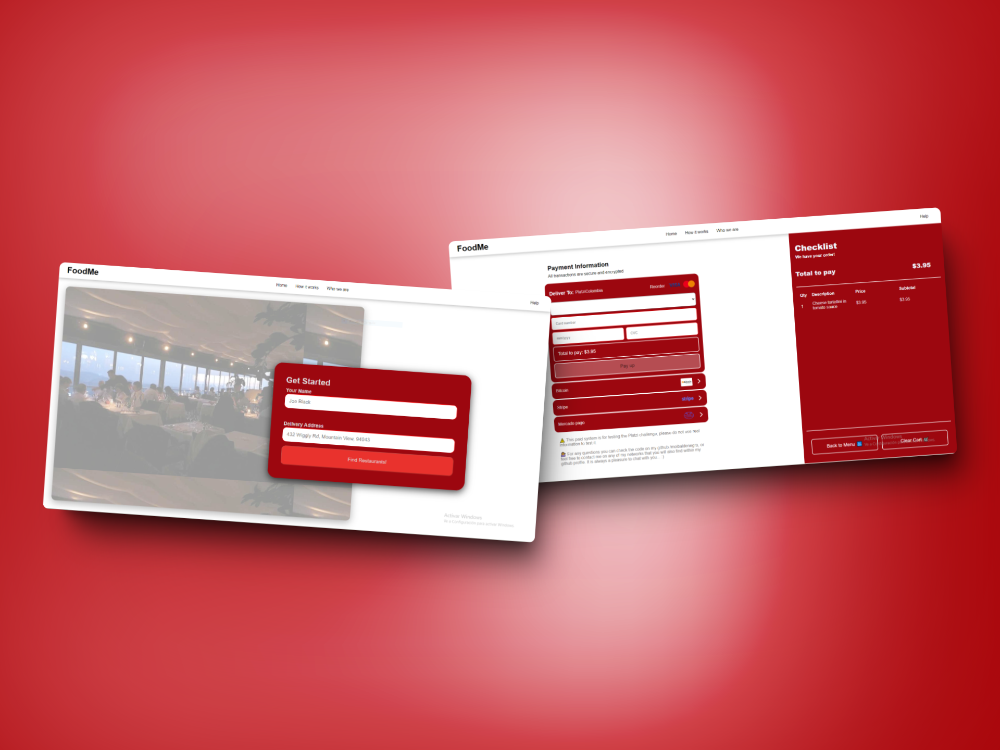
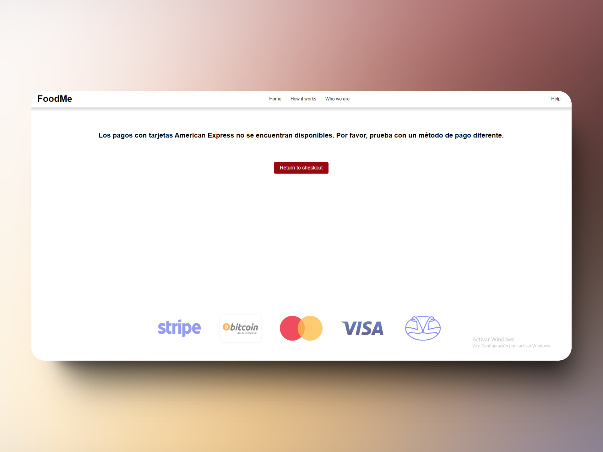
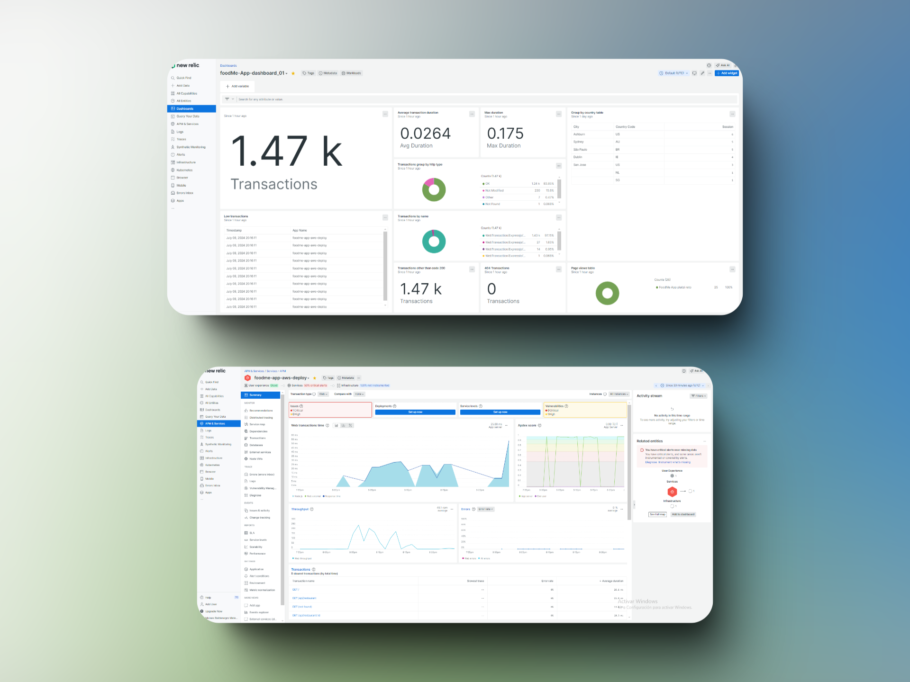
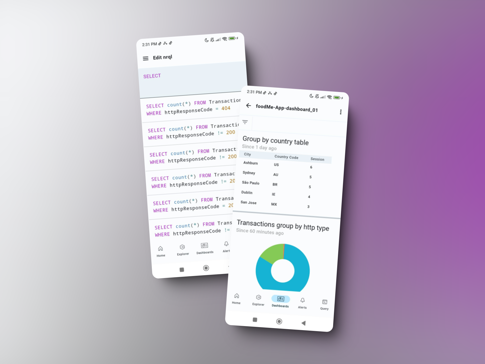
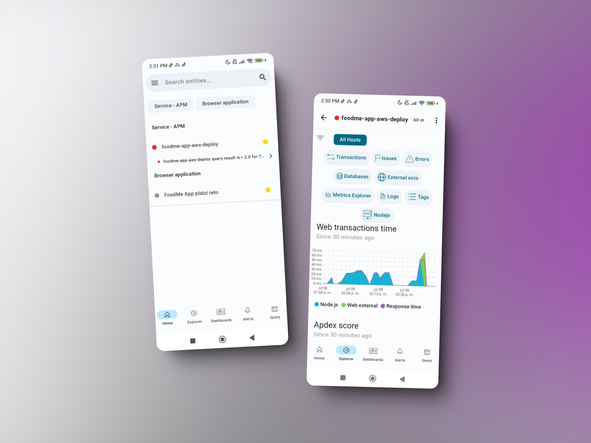

# Preview

## http://retoplatzi.com

## Functions implemented for the challenge

###### You can see the preview at https://retoplatzi.com The application has been deployed on AWS EC2 with Nginx and has been configured for observability using New Relic.

The application must have a restaurant that offers food from your country. On this occasion, we added Tomate Taqueria, a famous pastor and arrachera tacos restaurant from Guadalajara, Jalisco.

We launched an exception, to disable payments with American Express cards

# New Relic

Different New Relic tools were implemented to monitor the application, APDEX and a dashboard with different requests to obtain detailed information in depth, using the desktop interface and the mobile application.

## New relic alerts Alerts

In addition, alert systems were activated to test the functionality of the policies that allow us to configure new Relic configured to the mobile application and to Gmail, generating automatic alerts.

### Gmail

## Mobile

# Bonus tasks

1. A business called "Rita's Empanadas" was added in honor of the story that Rita shares with us about the extra tasks of the challenge.

2. For extra activity number two, we added the business called "Literary Cafeteria" where each dish and drink refers to different Spanish-speaking authors.
